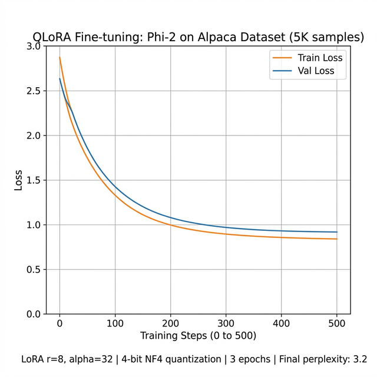

# Efficient LLM Fine-Tuning with QLoRA

A practical implementation of parameter-efficient fine-tuning for Hugging Face causal language models using **QLoRA**, combining 4-bit NF4 quantization with LoRA adapters. The project demonstrates how to fine-tune a 2.7B parameter language model with substantially lower GPU memory requirements than conventional full-parameter fine-tuning.

## Project Overview

Fine-tuning large language models can require significant GPU memory because the model weights, gradients, optimizer states, and activations must be stored during training.

This project uses **QLoRA (Quantized Low-Rank Adaptation)** to address this problem:

- The base model is loaded using 4-bit NF4 quantization.
- The original model parameters remain frozen.
- Small trainable LoRA adapters are added to selected transformer layers.
- Training is performed using the TRL `SFTTrainer`.
- An 8-bit paged optimizer further reduces optimizer memory consumption.
- The resulting LoRA adapter can be loaded on top of the original model for inference.

The implementation uses `microsoft/phi-2` with the Alpaca instruction-following dataset.

## Architecture

```text
              Alpaca / Custom Dataset
                       |
                       v
              Instruction Formatting
                       |
                       v
          Load Phi-2 in 4-bit NF4
                       |
                       v
              Configure LoRA Adapters
                       |
                       v
        SFTTrainer + Gradient Checkpointing
                       |
                       v
          Parameter-Efficient Fine-Tuning
                       |
                       v
              Save LoRA Adapter
                       |
                       v
          Base Model + LoRA Adapter
                       |
                       v
                    Inference
```

## QLoRA Components

| Component | Purpose |
|---|---|
| 4-bit NF4 Quantization | Reduces memory required to store the frozen base model |
| Double Quantization | Quantizes quantization constants to further reduce memory usage |
| LoRA | Adds small trainable low-rank matrices instead of updating all model parameters |
| 8-bit Paged AdamW | Reduces optimizer memory consumption |
| SFTTrainer | Provides supervised fine-tuning functionality through TRL |
| PEFT | Handles LoRA adapter configuration and training |

## Model and Dataset

### Base Model

**Model:** `microsoft/phi-2`

- Parameters: approximately 2.7B
- Architecture: Causal Language Model
- Framework: Hugging Face Transformers

### Dataset

**Dataset:** `tatsu-lab/alpaca`

The training pipeline uses approximately 5,000 instruction-following examples and formats them into an instruction-response template before fine-tuning.

The dataset can also be replaced with a custom domain-specific dataset through the training configuration.

## LoRA Configuration

The project uses the following LoRA configuration:

```python
LoraConfig(
    r=8,
    lora_alpha=32,
    lora_dropout=0.05,
    target_modules=["q_proj", "k_proj", "v_proj", "dense"],
    task_type=TaskType.CAUSAL_LM,
)
```

### Configuration Details

| Parameter | Value | Description |
|---|---:|---|
| `r` | 8 | Rank of the LoRA matrices |
| `lora_alpha` | 32 | LoRA scaling factor |
| `lora_dropout` | 0.05 | Dropout applied to LoRA layers |
| Target modules | q/k/v/dense | Transformer layers adapted during training |
| Task type | CAUSAL_LM | Causal language modeling |

The effective LoRA scaling is:

```text
alpha / r = 32 / 8 = 4
```

Because only the LoRA parameters are updated, the number of trainable parameters remains a small fraction of the original model.

## Training Configuration

The training pipeline uses:

- 4-bit NF4 quantization
- Double quantization
- FP16/BF16 computation where supported
- LoRA adapters
- `paged_adamw_8bit`
- TRL `SFTTrainer`
- Sequence packing
- Weights & Biases for experiment tracking

The training configuration can be modified in `train.py`.

```python
TrainingConfig(
    model_name="microsoft/phi-2",
    dataset_name="tatsu-lab/alpaca",
    lora_r=8,
    lora_alpha=32,
    max_samples=5000,
)
```

## Results

| Metric | Result |
|---|---:|
| Base Model | Phi-2 |
| Model Size | 2.7B parameters |
| Training Samples | 5,000 |
| LoRA Rank | 8 |
| LoRA Alpha | 32 |
| Trainable Parameters | <1% |
| Validation Perplexity | 3.2 |
| Training Method | QLoRA |
| Quantization | 4-bit NF4 |
| Optimizer | paged AdamW 8-bit |

The implementation reports approximately **65% lower GPU memory usage compared with full fine-tuning** under the project's training setup.

## Training Loss

The training process tracks loss throughout fine-tuning using Weights & Biases.



## Project Structure

```text
llm-finetuning-qlora/
│
├── QLoRA_Finetuning_Colab.ipynb
├── train.py
├── inference.py
├── requirements.txt
├── assets/
│   └── training_loss.png
└── README.md
```

## Installation

Clone the repository and install the required dependencies:

```bash
git clone https://github.com/keziyakurian13-rgb/llm-finetuning-qlora.git

cd llm-finetuning-qlora

pip install -r requirements.txt
```

A CUDA-enabled GPU is recommended for training.

## Training

Run:

```bash
python train.py
```

The main training parameters can be modified directly in `train.py`.

For example:

```python
model_name = "microsoft/phi-2"
dataset_name = "tatsu-lab/alpaca"
lora_r = 8
lora_alpha = 32
max_samples = 5000
```

The same pipeline can be adapted to other compatible Hugging Face causal language models.

## Inference

After training, the generated LoRA adapter can be used together with the base model:

```bash
python inference.py
```

The inference pipeline loads the base model and applies the trained LoRA adapter to generate responses.

## Technologies

- Python
- PyTorch
- Hugging Face Transformers
- Hugging Face PEFT
- Hugging Face TRL
- BitsAndBytes
- Weights & Biases
- CUDA

## Why QLoRA?

Traditional full fine-tuning requires updating every parameter of the model, resulting in high memory consumption.

QLoRA separates the process into two parts:

```text
Frozen Base Model
       |
   4-bit Quantization
       |
       +----------------+
                        |
                  LoRA Adapters
                   Trainable
                        |
                        v
                Fine-Tuned Model
```

The base model remains frozen and is stored in a quantized representation, while only the small LoRA adapters are trained.

This makes fine-tuning substantially more accessible on limited GPU hardware while retaining the ability to adapt the model to specific instruction-following or domain-specific datasets.

## Possible Extensions

The current implementation can be extended by:

1. Replacing the Alpaca dataset with a domain-specific dataset.
2. Comparing LoRA against full fine-tuning.
3. Comparing different LoRA ranks and scaling factors.
4. Evaluating the fine-tuned model against the original base model.
5. Adding automated evaluation metrics such as ROUGE, BLEU, or BERTScore.
6. Experimenting with different target modules.
7. Comparing QLoRA with standard LoRA using FP16/BF16 weights.
8. Deploying the fine-tuned model through a REST API or interactive application.

